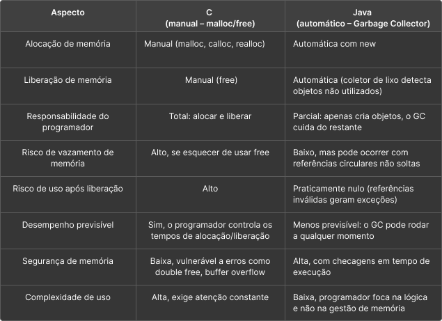

# Desafio 10 – Gerenciamento de Memória

Este desafio propõe a análise comparativa entre dois modelos de gerenciamento de memória:
- C*(controle manual pelo programador com `malloc`/`free`)
- Java (gerenciamento automático via Garbage Collector)

---

##  Tabela Comparativa

---

## Exemplo de implementação

### C – Alocação e Liberação Manual

```c
#include <stdio.h>
#include <stdlib.h>

int main() {
    int *numeros = (int*) malloc(3 * sizeof(int));
    if (numeros == NULL) {
        printf("Erro de alocação.\n");
        return 1;
    }

    numeros[0] = 10;
    numeros[1] = 20;
    numeros[2] = 30;

    printf("Valores: %d, %d, %d\n", numeros[0], numeros[1], numeros[2]);

    free(numeros); // Liberação manual
    return 0;
}
```

### Java – Gerenciamento Automático

```java
public class MemoriaJava {
    public static void main(String[] args) {
        int[] numeros = new int[3];
        numeros[0] = 10;
        numeros[1] = 20;
        numeros[2] = 30;

        System.out.println("Valores: " + numeros[0] + ", " + numeros[1] + ", " + numeros[2]);

        // Não há necessidade de liberar manualmente
    }
}
```
---

## Conclusão

A linguagem C oferece controle total sobre a memória, o que pode ser vantajoso em sistemas embarcados ou de tempo real, mas exige cuidado rigoroso do programador. Já o Java adota um modelo de gerenciamento mais seguro e automático, ideal para aplicações onde a produtividade e a confiabilidade são mais importantes que o controle fino da performance.
